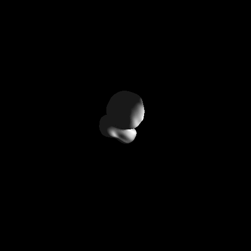

# Neural SDF

Обучение и рендеринг нейронной SDF с [архитектурой SIREN](https://arxiv.org/pdf/2006.09661). 

Реализовано:
- Прямой проход сети
- Расчет градиентов и обратный проход
- Шаг оптимизатора Adam

<figure>
    
    <figcaption>Рендер с помощью обученной функции дистанции</figcaption>
</figure>

## Интерфейс запуска, замеры времени

Обучение производится со следующими параметрами:
```bash
# для запуска
source .env && make train

# параметры прописаны в Makefile
./$(BUILD_DIR)/bin/train \
    --n_hidden 2 \                                     # число скрытых слоев
    --hidden_size 64 \                                 # размерность скрытых слоев
    --batch_size 512 \                                 # батч сайз для обучения
    --train_sample $(POINTS)/sdf1_train.bin \          # обучающая выборка
    --train_cfg $(CONF)/train.txt \                    # конфиг с lr, числом эпох
    --save_to $(WEIGHTS)/sdf1_trained_weights_512.bin  # куда сохранить веса
```

Опции для рендера:
```bash
# для запуска
source .env && make render

./$(BUILD_DIR)/bin/render \
    --n_hidden 2 \                                      # число скрытых слоев
    --hidden_size 64 \                                  # число скрытых слоев                                  
    --batch_size 1 \                                    # батч сайз для инференса (поддержан только = 1)
    --weights $(WEIGHTS)/sdf1_trained_weights_512.bin \ # веса для загрузки
    --camera $(CONF)/camera_1.txt \                     # конфиг камеры
    --light $(CONF)/light.txt \                         # конфиг с источником света
    --save_to $(PICTURES)/out_cpu_cpp_bsize_512.bmp     # куда сохранить рендер
```

В зависимости от сборки запуск будет автоматически происходить либо на CPU, либо на GPU.

По времени: трейн в среднем занимает ~3 минуты, рендер 30-40 секунд. При сборке под GPU заметного ускорения нет.

## Сборка

Список зависимостей:
- python (>=3.9,<3.11)
- cmake (>=3.16)
- Пакетный менеджер poetry
- [kernel_slicer](https://github.com/Ray-Tracing-Systems/kernel_slicer) (для сборки под GPU)

Скачиваем код и другие зависимости:
```bash
git clone https://github.com/dmitrylala/Neural-SDF.git && cd Neural-SDF
git submodule init && git submodule update
```

Инициализируем python venv:
```bash
# так можно явно указать версию питона для использования
poetry env use $(which python3.9)

poetry install --no-root
poetry shell
```

Подготовка к сборке C++ проекта:
```bash
conan profile detect
source .env
```

Цели для сборки в Makefile:
```bash
$ make help
help                           Show help
clean                          Clean autogenerated files
build_cpu                      Configure and build for CPU
run_kslicer                    Generate Vulkan code with kslicer
build_gpu                      Configure and build for GPU
train                          Run train
render                         Run render
test_unit                      Run unit tests
train_py                       Train network with numpy
infer_py                       Run network inference on python
```

Собираем под CPU и запускаем трейн:
```bash
make build_cpu && make train
```

Перед сборкой под GPU нужно единоразово указать пути до установленного kernel slicer:
```
bash scripts/setup_kslicer.sh my/path/kernel_slicer/cmake-build-release/kslicer my/path/kernel_slicer

# собираем
make build_gpu
```

**Note**: между сборками под CPU и GPU нужно делать очистку сгенерированных файлов, в том числе cmake кэша:
```
make clean
```

## Спецификация ПК

Сборка и запуск производились на машине со следующими версиями софта:
- OS: Ubuntu 20.04.6 LTS focal
- cmake version 3.16.3
- gcc version 9.4.0
- OpenMP 4.5
- Vulkan SDK 1.3.275

Железки:
- cpu: 11th Gen Intel(R) Core(TM) i7-1185G7 @ 3.00GHz
- graphics: VGA compatible controller: Intel Corporation Device 9a49 (rev 01)


